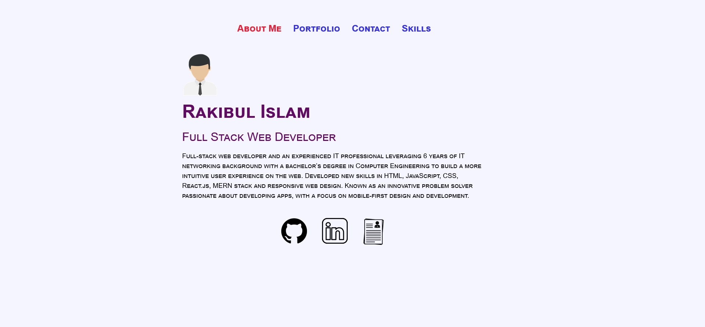

# React Portfolio

## Description
This is a portfolio of my past projects using React to showcase my work to hiring managers.
Email.Js package was used for the contact form which allows us to connect to other email services through which the emails are sent. Therefore anyone can send me a message which gets sent to my inbox as an email.

## Table of Contents
* [Usage](#usage)
* [License](#license)
* [Contributing](#contributing)
* [Tests](#tests)
* [Questions](#questions)

## Usage
💻

Here are the steps to start this React App:

`git clone https://github.com/Rakibca/react-portfolio.git` to any directory.

`cd react-portfolio`

`npm install`

`npm start`

Deployed App Link: `https://www.rakib.ca`

## License
This project is licensed under MIT.

## Contributing
Anyone can contribute to this project. Please make sure to fork this repo.

## Tests
No tests were used for this project.

## Questions
If you have any questions about this project, please contact me.
You can view more of my projects at `https://github.com/Rakibca`
